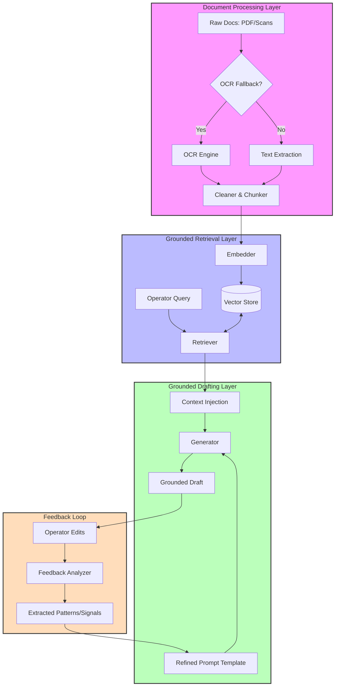

# System Architecture

The LegalDoc AI Engine is built on a modular RAG (Retrieval-Augmented Generation) framework designed to handle high-noise legal documents and implement a continuous learning loop.

## High-Level Workflow

The system is organized into four primary layers, ensuring a separation of concerns and maintainable code as required by the Pearson Specter Litt engineering standards.

### 1. Document Ingestion Layer (`app/processing`)
This layer handles the "messy" input problem. It coordinates between standard PDF extraction and OCR fallbacks.
* **Cleaning**: Normalizes text and handles illegible or inconsistent formatting.
* **Chunking**: Breaks down large legal records into manageable segments while preserving semantic context.

### 2. Knowledge Retrieval Layer (`app/retrieval`)
Responsible for anchoring the generation process in truth.
* **Vector Indexing**: Uses high-dimensional embeddings to map the semantic space of the documents.
* **Evidence Surfacing**: Queries the vector store to find the most relevant document segments for a specific drafting task.

### 3. Grounded Generation Layer (`app/generation`)
The "Brain" of the system, focused on high-fidelity drafting.
* **Context Injection**: Combines operator queries with retrieved evidence.
* **Anti-Hallucination Logic**: Uses strict prompt constraints to ensure every assertion is grounded in the provided context.

### 4. Learning & Feedback Layer (`app/feedback`)
The improvement engine that makes the system smarter over time.
* **Edit Analysis**: Compares generated drafts against operator-finalized versions.
* **Pattern Extraction**: Learns 

## Data Flow Diagram

## Component Interaction

| Component | Input | Output |
| :--- | :--- | :--- |
| **Processor** | Raw Files (PDF/Scans) | Cleaned Chunks + Metadata |
| **Retriever** | User Query + Chunks | Relevant Context Segments |
| **Generator** | Context + Persona | Grounded Draft |
| **Feedback** | Draft + Operator Edits | Improvement Signals |

## Design Principles

* **Modularity**: Each component is independent, allowing for easy updates (e.g., swapping the OCR engine or the Embedding model).
* **Grounding First**: The system is architected to fail or admit ignorance rather than hallucinate.
* **Scalability**: The use of a decoupled vector store and structured processing allows the engine to handle growing legal repositories efficiently.